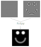

# Fast (ish) Checkboard Demodulation #
Fast Checkerboard Demodulation (FCD) for Synthetic Schlieren imaging, in python

Almost completely based on the work from Sander Wildeman: https://github.com/swildeman/fcd



## Usage ##
To apply the FCD to a single or series of images, run `fcd.py` as a program:

Run `python fcd.py --help` to see how to use it.
```
usage: fcd.py [-h] [--output-format {tiff,bmp,png,jpg,jpeg}] [--skip-existing]
              output_folder reference_image definition_image
              [definition_image ...]

positional arguments:
  output_folder
  reference_image
  definition_image      May contain wildcards

optional arguments:
  -h, --help            show this help message and exit
  --output-format {tiff,bmp,png,jpg,jpeg}
                        The output format (default: tiff)
  --skip-existing       Skip processing an image if the output file already
                        exists (default: False)
```

### Example on generated test image ###
If you don't have images to apply FCD on, you can generate one with `generate_test_images.py`:
run
```python generate_test_images.py ripples```

This program will generate a reference image, a distorted image and a height field to test against.
If you like smileys, you can replace `ripples` by `smiley`.

If you like to change some parameters (e.g. pattern frequency), run `python generate_test_images.py --help` to see what can be changed and how.

To apply the FCD, run:
`python fcd.py test_output "test image reference.tiff" "test image displaced.tiff"`

This will apply the FCD with the output file `test_output/test image displaced.tiff`, which should resemble the file `test image height field.tiff` 

## Dependencies ##
Python >= 3.7  and the following PIP packages:
* numpy
* scipy
* imageio
* more_itertools
* scikit-image

## TODO ##
* Improve the performance. The current implementation is not very fast

## About FCD ##
Information on the FCD technique and the employed algorithms can be found in: Wildeman S., *Real-time quantitative Schlieren imaging by fast Fourier demodulation of a checkered backdrop*, Exp. Fluids (2018) 59: 97, https://doi.org/10.1007/s00348-018-2553-9, or https://arxiv.org/abs/1712.05679 (preprint)
